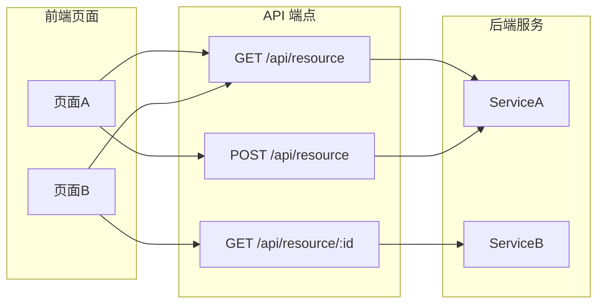

# 接口依赖图

```mermaid
graph LR
    subgraph Frontend[前端页面]
        P1[页面A]
        P2[页面B]
    end
    subgraph API[API 端点]
        E1[GET /api/resource]
        E2[POST /api/resource]
        E3[GET /api/resource/:id]
    end
    subgraph Backend[后端服务]
        S1[ServiceA]
        S2[ServiceB]
    end
    P1 --> E1
    P1 --> E2
    P2 --> E1
    P2 --> E3
    E1 --> S1
    E2 --> S1
    E3 --> S2
```
