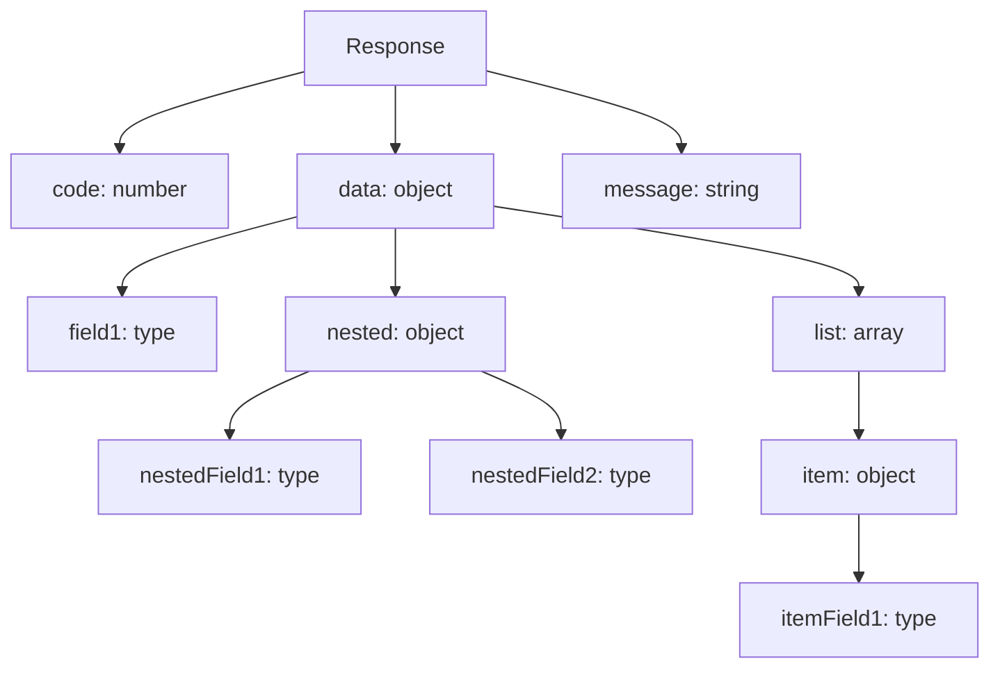

# 响应结构图

```mermaid
graph TD
    Root[Response] --> Code[code: number]
    Root --> Data[data: object]
    Root --> Message[message: string]
    Data --> Field1[field1: type]
    Data --> Nested[nested: object]
    Nested --> NField1[nestedField1: type]
    Nested --> NField2[nestedField2: type]
    Data --> Array[list: array]
    Array --> Item[item: object]
    Item --> IField1[itemField1: type]
```
