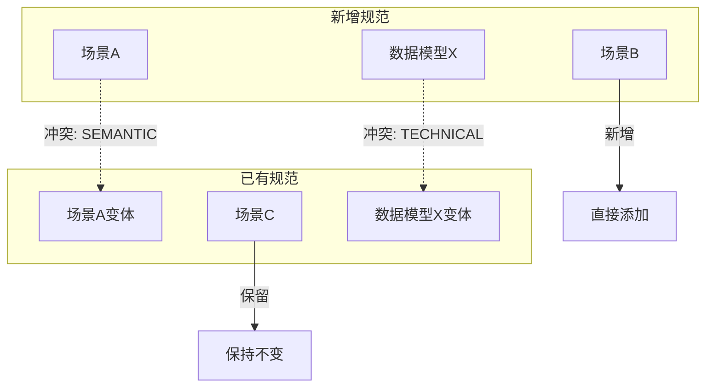

# 合并冲突关系图

```mermaid
graph TD
    subgraph NEW[新增规范]
        S1[场景A]
        S2[场景B]
        M1[数据模型X]
    end
    subgraph EXISTING[已有规范]
        S3[场景A变体]
        S4[场景C]
        M2[数据模型X变体]
    end
    S1 -.->|冲突: SEMANTIC| S3
    S2 -->|新增| ADD[直接添加]
    M1 -.->|冲突: TECHNICAL| M2
    S4 -->|保留| KEEP[保持不变]
```
