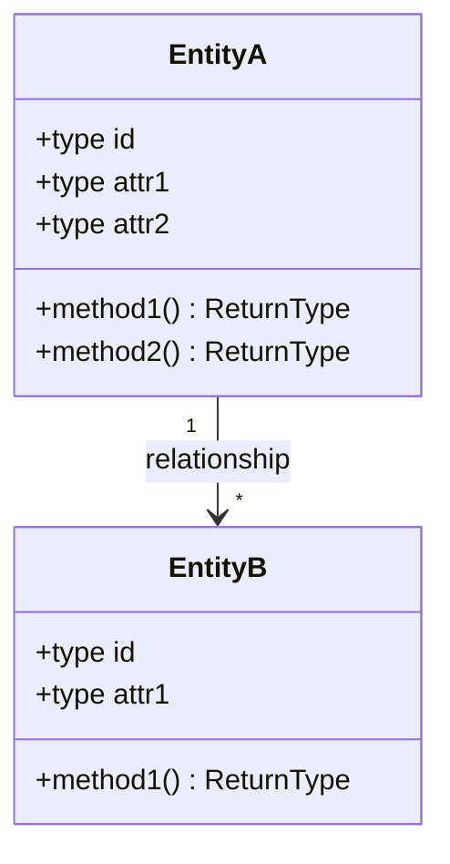

# 领域模型类图

```mermaid
classDiagram
    class EntityA {
        +type id
        +type attr1
        +type attr2
        +method1() ReturnType
        +method2() ReturnType
    }
    class EntityB {
        +type id
        +type attr1
        +method1() ReturnType
    }
    EntityA "1" --> "*" EntityB : relationship
```
