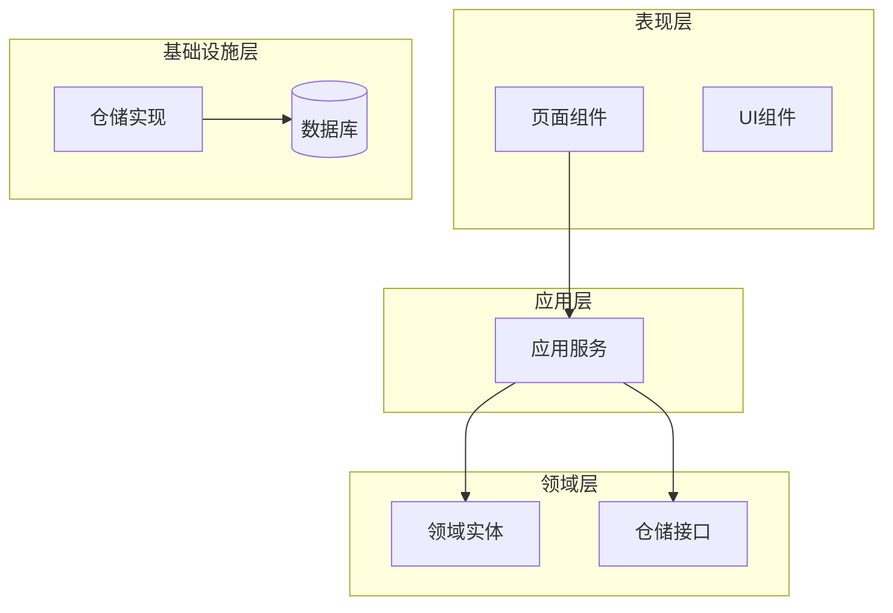

# 组件图

```mermaid
graph TD
    subgraph Presentation[表现层]
        Page[页面组件]
        UI[UI组件]
    end
    subgraph Application[应用层]
        Service[应用服务]
    end
    subgraph Domain[领域层]
        Entity[领域实体]
        Repo[仓储接口]
    end
    subgraph Infrastructure[基础设施层]
        RepoImpl[仓储实现]
        DB[(数据库)]
    end
    Page --> Service
    Service --> Entity
    Service --> Repo
    RepoImpl --> DB
```
