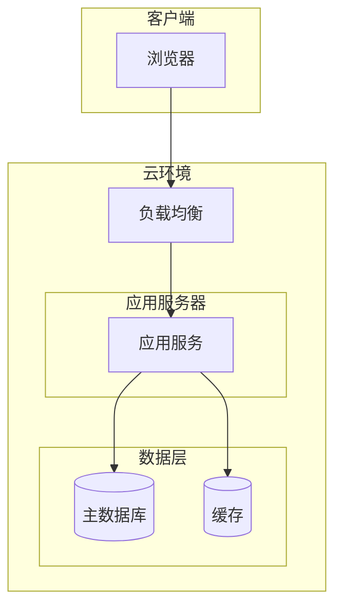

# 部署图

```mermaid
graph TD
    subgraph Client[客户端]
        Browser[浏览器]
    end
    subgraph Cloud[云环境]
        LB[负载均衡]
        subgraph Server[应用服务器]
            App[应用服务]
        end
        subgraph Data[数据层]
            DB[(主数据库)]
            Cache[(缓存)]
        end
    end
    Browser --> LB
    LB --> App
    App --> DB
    App --> Cache
```
