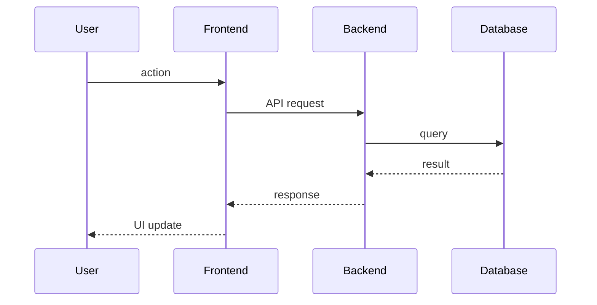

# 时序图

```mermaid
sequenceDiagram
    participant U as User
    participant F as Frontend
    participant B as Backend
    participant D as Database
    U->>F: action
    F->>B: API request
    B->>D: query
    D-->>B: result
    B-->>F: response
    F-->>U: UI update
```
