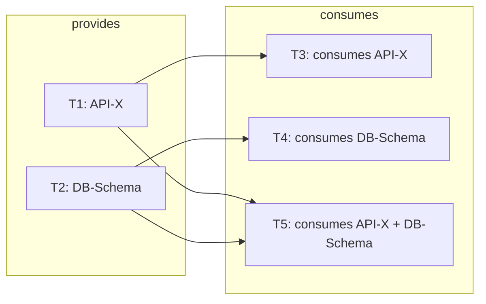

# provides/consumes 接口依赖图

```mermaid
graph LR
    subgraph Providers[provides]
        T1[T1: API-X]
        T2[T2: DB-Schema]
    end
    subgraph Consumers[consumes]
        T3[T3: consumes API-X]
        T4[T4: consumes DB-Schema]
        T5[T5: consumes API-X + DB-Schema]
    end
    T1 --> T3
    T1 --> T5
    T2 --> T4
    T2 --> T5
```
