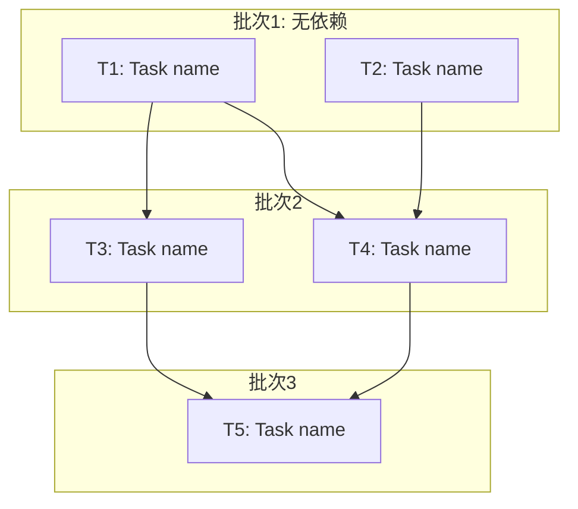

# 任务依赖 DAG

```mermaid
graph TD
    subgraph Batch1[批次1: 无依赖]
        T1[T1: Task name]
        T2[T2: Task name]
    end
    subgraph Batch2[批次2]
        T3[T3: Task name]
        T4[T4: Task name]
    end
    subgraph Batch3[批次3]
        T5[T5: Task name]
    end
    T1 --> T3
    T1 --> T4
    T2 --> T4
    T3 --> T5
    T4 --> T5
```
