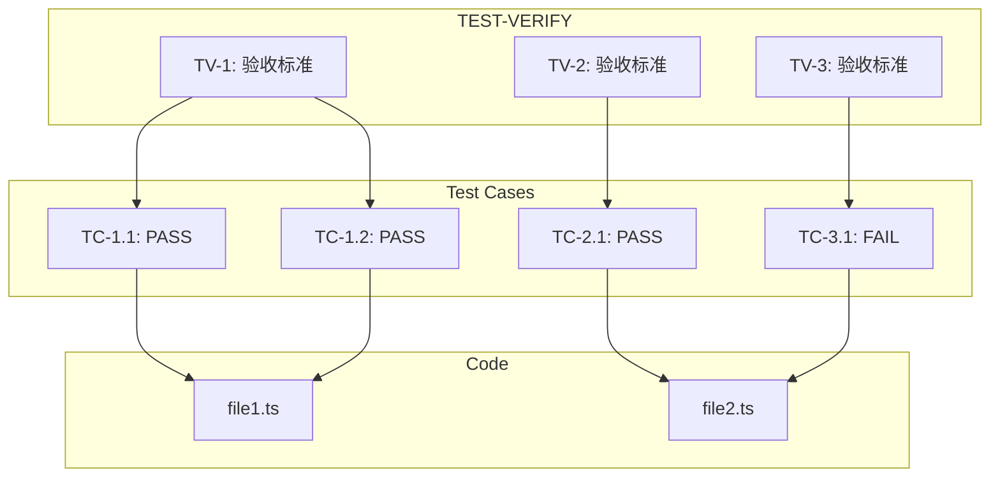

# 闭环验证矩阵

```mermaid
graph TD
    subgraph SPEC[TEST-VERIFY]
        TV1[TV-1: 验收标准]
        TV2[TV-2: 验收标准]
        TV3[TV-3: 验收标准]
    end
    subgraph TEST[Test Cases]
        TC1[TC-1.1: PASS]
        TC2[TC-1.2: PASS]
        TC3[TC-2.1: PASS]
        TC4[TC-3.1: FAIL]
    end
    subgraph CODE[Code]
        F1[file1.ts]
        F2[file2.ts]
    end
    TV1 --> TC1
    TV1 --> TC2
    TV2 --> TC3
    TV3 --> TC4
    TC1 --> F1
    TC2 --> F1
    TC3 --> F2
    TC4 --> F2
```
