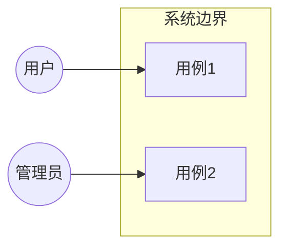
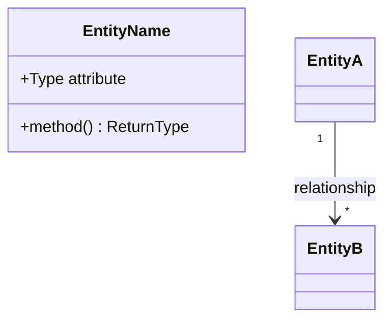
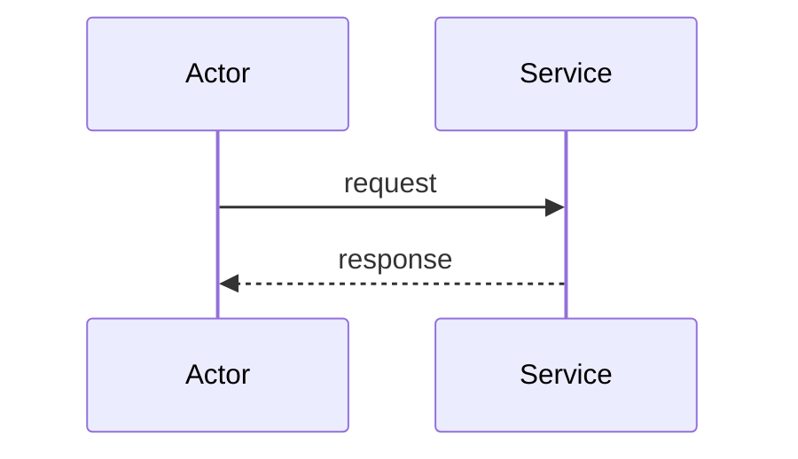
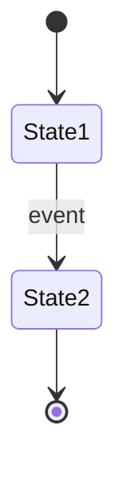
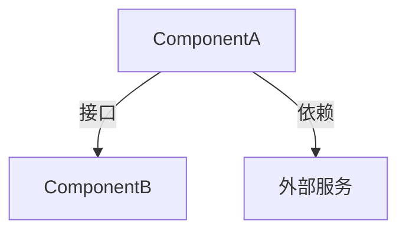
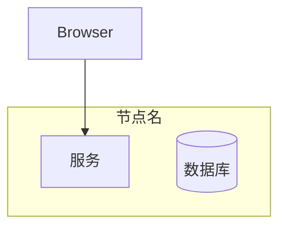

# UML 设计图指南

基于 UML 2.x 标准的 6 类设计图，统一使用 Mermaid 语法输出文本化图表。

## 理论基础

- **UML 2.x** (OMG 标准)：结构图（类图/组件图/部署图）描述系统静态结构，行为图（用例图/时序图/状态图）描述系统动态行为
- **C4 模型补充** (Simon Brown)：当 UML 过于技术化时，使用 System Context → Container → Component → Code 四级视图，先给宏观再给细节
- **Mermaid**：文本化图表语言，Git 可版本控制，GitHub/GitLab 原生渲染，无需外部工具

## 触发策略

| 模式 | 行为 |
|------|------|
| `按需`（默认） | 复杂度达到阈值自动生成对应类型图 |
| `全部` | 生成全部 6 类图 |
| `跳过` | 仅文本 design.md |

详见 `references/diagram-trigger-rules.md`（各阶段精确阈值）。

## 6 类 UML 图

### 用例图 (Use Case Diagram)

描述 Actor 与系统的交互边界和用例关系。

### 类图 (Class Diagram)

描述实体属性、方法、关联和多重性。

### 时序图 (Sequence Diagram)

描述参与者间的消息交互顺序。

### 状态图 (State Diagram)

描述实体状态和转换事件。

### 组件图 (Component Diagram)

描述组件、接口和依赖关系。

### 部署图 (Deployment Diagram)

描述节点和部署关系。

## 输出规范

- 每图一个 `.md` 文件，含解释性标题和简要说明
- 输出到 `orch-spec/{req_id}/{stage}/diagrams/` 目录
- design.md 等主文档中引用图文件路径
- 快速模式下跳过所有图生成
