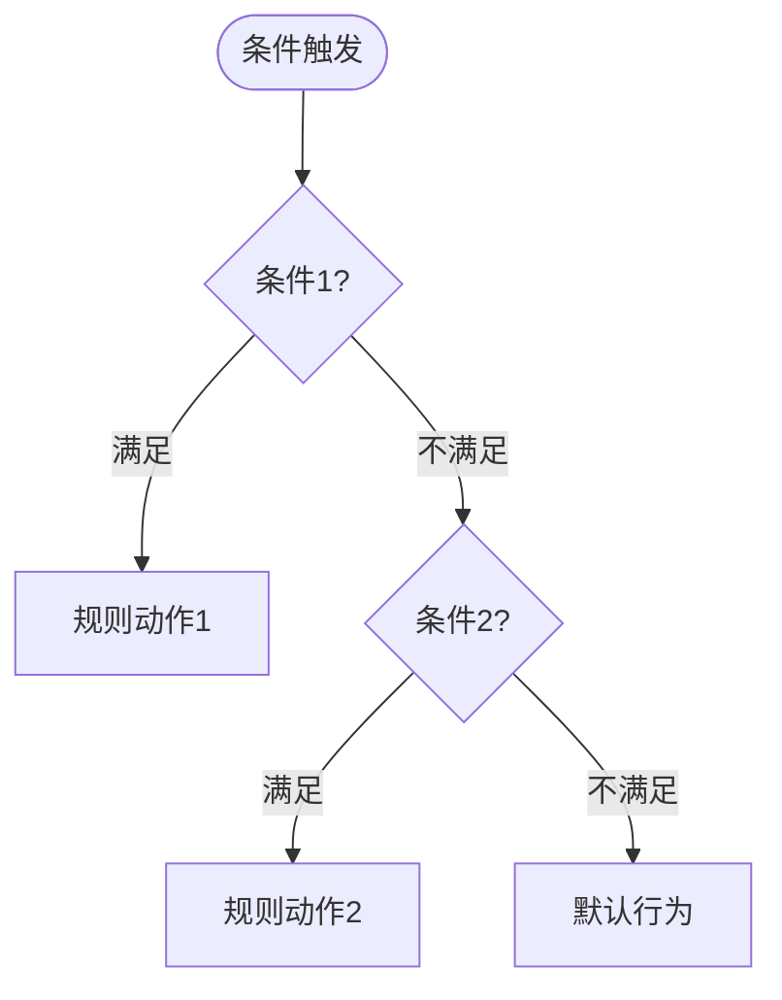

# 业务规则决策树

```mermaid
graph TD
    Start([条件触发]) --> Check1{条件1?}
    Check1 -->|满足| Action1[规则动作1]
    Check1 -->|不满足| Check2{条件2?}
    Check2 -->|满足| Action2[规则动作2]
    Check2 -->|不满足| Default[默认行为]
```
