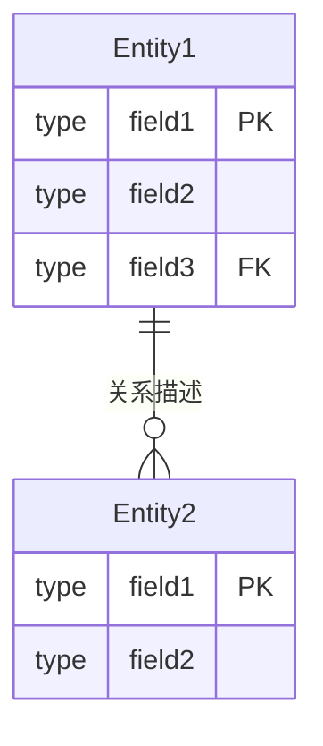

# ER 图 — 数据实体关系

```mermaid
erDiagram
    Entity1 {
        type field1 PK
        type field2
        type field3 FK
    }
    Entity2 {
        type field1 PK
        type field2
    }
    Entity1 ||--o{ Entity2 : "关系描述"
```
