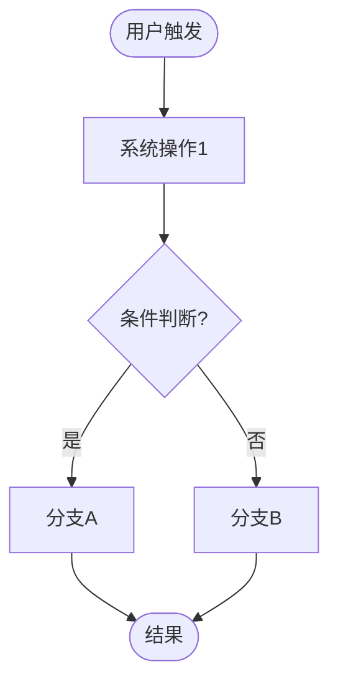

# 场景流程图 — 用户系统交互

```mermaid
graph TD
    Start([用户触发]) --> Step1[系统操作1]
    Step1 --> Decision{条件判断?}
    Decision -->|是| PathA[分支A]
    Decision -->|否| PathB[分支B]
    PathA --> End([结果])
    PathB --> End
```
